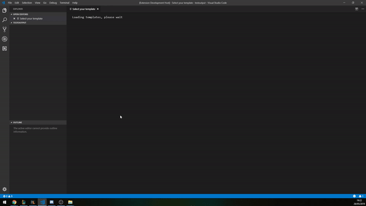

# Dotnet new extension

This extension is built on top of the `dotnet new` CLI, it allows for an easier creation of templates, by selecting the template, filling out the parameters & use the create button.

## Features

Currently this extension adds a command (`Dotnet new: Create item from template`). This will create a new window with all the currently available templates in dotnet new (including separately installed templates).

## Requirements

`dotnet core sdk`

This extension is dependent on the `dotnet new` CLI. It is tested with `dotnet core 2.0` and `dotnet core 2.1`. It might work for `dotnet core 1.0`.

## Known Issues

When reopening create tab, it switches back to template overview.

## Release Notes

### 1.0.0

Initial release of `dotnet-new-extension`.

### 1.0.1

Fixed issue where the html wasn't packaged properly, now it does work.

### 1.0.2

Created styling for the webview based on settings of your current theme.

## Upcoming features

- create template in folder from right click folder